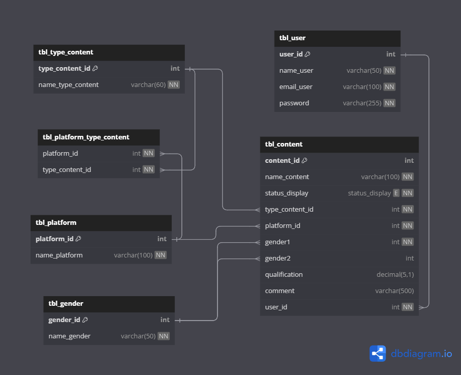
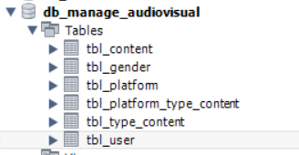

# Audivisual Management System
## Description

This audiovisual content management system is designed to manage and organize multimedia content effectively and efficiently.  Our system provides an intuitive and easy-to-use interface, but with all the necessary features for complete control over your content.

## Used technology

- Java
- Spring Boot 
  + JPA
  + JPQL
  +  Spring Security
  +  JWT
- MySQL
- Swagger

### Java

Java is the main programming language used in this project. It is an object-oriented programming language that is robust, secure and portable.

### SpringBoot

Spring Boot is a framework used to create Spring-based applications quickly and easily. Provides a default configuration for Spring applications so we can quickly start development.

### MySQL

MySQL is the database management system that we use to store all system information. It is a relational database system that is fast, reliable and easy to use.

### SpringSecurity

Spring Security is used to provide security in the system. It provides features such as authentication and authorization to ensure that only authorized users have access to certain parts of the system.

### JWT (JSON Web Tokens)

JWT is used for authentication and security of user sessions. It is an open standard that defines a compact and secure way to transmit information between parties as a JSON object.

### Spring Data JPA

Spring Data JPA is a part of the Spring Data project, which makes it easy to implement data repositories. JPA (Java Persistence API) is a Java specification for accessing, persisting, and managing data between Java objects/classes and a relational database. Spring Data JPA provides an implementation of JPA standards to reduce the amount of manual work.

# Database
The database management system chosen for the project was mySQL, which is very flexible and fast.

## Entity Relationship Diagram

<div align="center">
  
</div>

## Tables

<div align="center">
  
</div>

## Installation and Execution

1. Clone this repository to your local machine.

```bash
git clone https://github.com/Dabrox02/audiovisual-management-springboot.git
```
2. Access the 'main' branch

```bash
git switch main
```

3. Configure the Application properties according to your mySQL or database management system username and password. Application properties is a general settings file for spring boot

<div align="center">
  <h3>Application properties Mysql</h3>
  
</div>

- *spring.datasource.url=jdbc:mysql://localhost:3306/db_manage_audiovisual* you change *db_manage_audiovisual* to the name of the database you defined
- *spring.datasource.username* you change the password 
- *spring.datasource.password* you change the user 

If you are using another database management system, you must find the corresponding dependency and add it to the pom file, and change the application properties settings to match your new database management system.

<div align="center">
  <h3>Mysql dependency</h3>
  
</div>

4. You can use the api documentation that is provided by swagger. With this documentation you can test the queries if you want to 

<div align="center">
   <h3>Swagger settings in application properties</h3>
  
</div>

You just have to enter the following link in your web browser

```bash
http://localhost:8080/doc/swagger-ui/index.html
```

<div align="center">
  <h3>Swagger view</h3>
  
</div>


5. Start the application, execute 'Run Application'.

<div align="center">
  <h3>Run Application</h3> 
  
</div>


## Api Reference

> Scroll down for code samples, example requests and responses. Select a language for code samples from the tabs above or the mobile navigation menu.

Base URLs:

* <a href="http://localhost:8080">http://localhost:8080</a>

# Authentication

- HTTP Authentication, scheme: bearer JWT Auth Description

<h1 id="-content-controller">content-controller</h1>

## updaEntity

<a id="opIdupdaEntity"></a>

> Code samples

```java
URL obj = new URL("http://localhost:8080/content/edit");
HttpURLConnection con = (HttpURLConnection) obj.openConnection();
con.setRequestMethod("PUT");
int responseCode = con.getResponseCode();
BufferedReader in = new BufferedReader(
    new InputStreamReader(con.getInputStream()));
String inputLine;
StringBuffer response = new StringBuffer();
while ((inputLine = in.readLine()) != null) {
    response.append(inputLine);
}
in.close();
System.out.println(response.toString());

```

`PUT /content/edit`

> Body parameter

```json
{
  "contentId": 0,
  "nameContent": "string",
  "statusDisplay": "PENDING",
  "qualification": 0,
  "comment": "string",
  "typeContentId": 0,
  "platformId": 0,
  "genderId1": 0,
  "genderId2": 0,
  "userId": 0
}
```

<h3 id="updaentity-parameters">Parameters</h3>

|Name|In|Type|Required|Description|
|---|---|---|---|---|
|body|body|[ContentDTO](#schemacontentdto)|true|none|

> Example responses

> 200 Response

<h3 id="updaentity-responses">Responses</h3>

|Status|Meaning|Description|Schema|
|---|---|---|---|
|200|[OK](https://tools.ietf.org/html/rfc7231#section-6.3.1)|OK|Inline|
|400|[Bad Request](https://tools.ietf.org/html/rfc7231#section-6.5.1)|Bad Request|Inline|
|401|[Unauthorized](https://tools.ietf.org/html/rfc7235#section-3.1)|Unauthorized|Inline|
|500|[Internal Server Error](https://tools.ietf.org/html/rfc7231#section-6.6.1)|Internal Server Error|Inline|
|501|[Not Implemented](https://tools.ietf.org/html/rfc7231#section-6.6.2)|Not Implemented|Inline|

<h3 id="updaentity-responseschema">Response Schema</h3>

<aside class="warning">
To perform this operation, you must be authenticated by means of one of the following methods:
bearerAuth
</aside>

## saveGender_2

<a id="opIdsaveGender_2"></a>

> Code samples

```java
URL obj = new URL("http://localhost:8080/content/add");
HttpURLConnection con = (HttpURLConnection) obj.openConnection();
con.setRequestMethod("POST");
int responseCode = con.getResponseCode();
BufferedReader in = new BufferedReader(
    new InputStreamReader(con.getInputStream()));
String inputLine;
StringBuffer response = new StringBuffer();
while ((inputLine = in.readLine()) != null) {
    response.append(inputLine);
}
in.close();
System.out.println(response.toString());

```

`POST /content/add`

> Body parameter

```json
{
  "contentId": 0,
  "nameContent": "string",
  "statusDisplay": "PENDING",
  "qualification": 0,
  "comment": "string",
  "typeContentId": 0,
  "platformId": 0,
  "genderId1": 0,
  "genderId2": 0,
  "userId": 0
}
```

<h3 id="savegender_2-parameters">Parameters</h3>

|Name|In|Type|Required|Description|
|---|---|---|---|---|
|body|body|[ContentDTO](#schemacontentdto)|true|none|

> Example responses

> 200 Response

<h3 id="savegender_2-responses">Responses</h3>

|Status|Meaning|Description|Schema|
|---|---|---|---|
|200|[OK](https://tools.ietf.org/html/rfc7231#section-6.3.1)|OK|Inline|
|400|[Bad Request](https://tools.ietf.org/html/rfc7231#section-6.5.1)|Bad Request|Inline|
|401|[Unauthorized](https://tools.ietf.org/html/rfc7235#section-3.1)|Unauthorized|Inline|
|500|[Internal Server Error](https://tools.ietf.org/html/rfc7231#section-6.6.1)|Internal Server Error|Inline|
|501|[Not Implemented](https://tools.ietf.org/html/rfc7231#section-6.6.2)|Not Implemented|Inline|

<h3 id="savegender_2-responseschema">Response Schema</h3>

<aside class="warning">
To perform this operation, you must be authenticated by means of one of the following methods:
bearerAuth
</aside>

## getAllById

<a id="opIdgetAllById"></a>

> Code samples

```java
URL obj = new URL("http://localhost:8080/content/?nameUser=string&password=string");
HttpURLConnection con = (HttpURLConnection) obj.openConnection();
con.setRequestMethod("GET");
int responseCode = con.getResponseCode();
BufferedReader in = new BufferedReader(
    new InputStreamReader(con.getInputStream()));
String inputLine;
StringBuffer response = new StringBuffer();
while ((inputLine = in.readLine()) != null) {
    response.append(inputLine);
}
in.close();
System.out.println(response.toString());

```

`GET /content/`

<h3 id="getallbyid-parameters">Parameters</h3>

|Name|In|Type|Required|Description|
|---|---|---|---|---|
|nameUser|query|string|true|none|
|password|query|string|true|none|

> Example responses

> 200 Response

<h3 id="getallbyid-responses">Responses</h3>

|Status|Meaning|Description|Schema|
|---|---|---|---|
|200|[OK](https://tools.ietf.org/html/rfc7231#section-6.3.1)|OK|Inline|
|400|[Bad Request](https://tools.ietf.org/html/rfc7231#section-6.5.1)|Bad Request|Inline|
|401|[Unauthorized](https://tools.ietf.org/html/rfc7235#section-3.1)|Unauthorized|Inline|
|500|[Internal Server Error](https://tools.ietf.org/html/rfc7231#section-6.6.1)|Internal Server Error|Inline|
|501|[Not Implemented](https://tools.ietf.org/html/rfc7231#section-6.6.2)|Not Implemented|Inline|

<h3 id="getallbyid-responseschema">Response Schema</h3>

<aside class="warning">
To perform this operation, you must be authenticated by means of one of the following methods:
bearerAuth
</aside>

<h1 id="-user-controller">user-controller</h1>

## registerUser

<a id="opIdregisterUser"></a>

> Code samples

```java
URL obj = new URL("http://localhost:8080/user/register?nameUser=string&password=string&emailUser=string");
HttpURLConnection con = (HttpURLConnection) obj.openConnection();
con.setRequestMethod("POST");
int responseCode = con.getResponseCode();
BufferedReader in = new BufferedReader(
    new InputStreamReader(con.getInputStream()));
String inputLine;
StringBuffer response = new StringBuffer();
while ((inputLine = in.readLine()) != null) {
    response.append(inputLine);
}
in.close();
System.out.println(response.toString());

```

`POST /user/register`

<h3 id="registeruser-parameters">Parameters</h3>

|Name|In|Type|Required|Description|
|---|---|---|---|---|
|nameUser|query|string|true|none|
|password|query|string|true|none|
|emailUser|query|string|true|none|

> Example responses

> 200 Response

<h3 id="registeruser-responses">Responses</h3>

|Status|Meaning|Description|Schema|
|---|---|---|---|
|200|[OK](https://tools.ietf.org/html/rfc7231#section-6.3.1)|OK|Inline|
|400|[Bad Request](https://tools.ietf.org/html/rfc7231#section-6.5.1)|Bad Request|Inline|
|401|[Unauthorized](https://tools.ietf.org/html/rfc7235#section-3.1)|Unauthorized|Inline|
|500|[Internal Server Error](https://tools.ietf.org/html/rfc7231#section-6.6.1)|Internal Server Error|Inline|
|501|[Not Implemented](https://tools.ietf.org/html/rfc7231#section-6.6.2)|Not Implemented|Inline|

<h3 id="registeruser-responseschema">Response Schema</h3>

<aside class="success">
This operation does not require authentication
</aside>

## loginUser

<a id="opIdloginUser"></a>

> Code samples

```java
URL obj = new URL("http://localhost:8080/user/login?nameUser=string&password=string");
HttpURLConnection con = (HttpURLConnection) obj.openConnection();
con.setRequestMethod("POST");
int responseCode = con.getResponseCode();
BufferedReader in = new BufferedReader(
    new InputStreamReader(con.getInputStream()));
String inputLine;
StringBuffer response = new StringBuffer();
while ((inputLine = in.readLine()) != null) {
    response.append(inputLine);
}
in.close();
System.out.println(response.toString());

```

`POST /user/login`

<h3 id="loginuser-parameters">Parameters</h3>

|Name|In|Type|Required|Description|
|---|---|---|---|---|
|nameUser|query|string|true|none|
|password|query|string|true|none|

> Example responses

> 200 Response

<h3 id="loginuser-responses">Responses</h3>

|Status|Meaning|Description|Schema|
|---|---|---|---|
|200|[OK](https://tools.ietf.org/html/rfc7231#section-6.3.1)|OK|Inline|
|400|[Bad Request](https://tools.ietf.org/html/rfc7231#section-6.5.1)|Bad Request|Inline|
|401|[Unauthorized](https://tools.ietf.org/html/rfc7235#section-3.1)|Unauthorized|Inline|
|500|[Internal Server Error](https://tools.ietf.org/html/rfc7231#section-6.6.1)|Internal Server Error|Inline|
|501|[Not Implemented](https://tools.ietf.org/html/rfc7231#section-6.6.2)|Not Implemented|Inline|

<h3 id="loginuser-responseschema">Response Schema</h3>

<aside class="success">
This operation does not require authentication
</aside>

## deleteUser

<a id="opIddeleteUser"></a>

> Code samples

```java
URL obj = new URL("http://localhost:8080/user/delete?nameUser=string&password=string");
HttpURLConnection con = (HttpURLConnection) obj.openConnection();
con.setRequestMethod("DELETE");
int responseCode = con.getResponseCode();
BufferedReader in = new BufferedReader(
    new InputStreamReader(con.getInputStream()));
String inputLine;
StringBuffer response = new StringBuffer();
while ((inputLine = in.readLine()) != null) {
    response.append(inputLine);
}
in.close();
System.out.println(response.toString());

```

`DELETE /user/delete`

<h3 id="deleteuser-parameters">Parameters</h3>

|Name|In|Type|Required|Description|
|---|---|---|---|---|
|nameUser|query|string|true|none|
|password|query|string|true|none|

> Example responses

> 200 Response

<h3 id="deleteuser-responses">Responses</h3>

|Status|Meaning|Description|Schema|
|---|---|---|---|
|200|[OK](https://tools.ietf.org/html/rfc7231#section-6.3.1)|OK|Inline|
|400|[Bad Request](https://tools.ietf.org/html/rfc7231#section-6.5.1)|Bad Request|Inline|
|401|[Unauthorized](https://tools.ietf.org/html/rfc7235#section-3.1)|Unauthorized|Inline|
|500|[Internal Server Error](https://tools.ietf.org/html/rfc7231#section-6.6.1)|Internal Server Error|Inline|
|501|[Not Implemented](https://tools.ietf.org/html/rfc7231#section-6.6.2)|Not Implemented|Inline|

<h3 id="deleteuser-responseschema">Response Schema</h3>

<aside class="success">
This operation does not require authentication
</aside>

<h1 id="-type-content-controller">type-content-controller</h1>

## saveTypeContent

<a id="opIdsaveTypeContent"></a>

> Code samples

```java
URL obj = new URL("http://localhost:8080/typeContent/add");
HttpURLConnection con = (HttpURLConnection) obj.openConnection();
con.setRequestMethod("POST");
int responseCode = con.getResponseCode();
BufferedReader in = new BufferedReader(
    new InputStreamReader(con.getInputStream()));
String inputLine;
StringBuffer response = new StringBuffer();
while ((inputLine = in.readLine()) != null) {
    response.append(inputLine);
}
in.close();
System.out.println(response.toString());

```

`POST /typeContent/add`

> Body parameter

```json
{
  "typeContentId": 0,
  "nameTypeContent": "string"
}
```

<h3 id="savetypecontent-parameters">Parameters</h3>

|Name|In|Type|Required|Description|
|---|---|---|---|---|
|body|body|[TypeContentDTO](#schematypecontentdto)|true|none|

> Example responses

> 200 Response

<h3 id="savetypecontent-responses">Responses</h3>

|Status|Meaning|Description|Schema|
|---|---|---|---|
|200|[OK](https://tools.ietf.org/html/rfc7231#section-6.3.1)|OK|Inline|
|400|[Bad Request](https://tools.ietf.org/html/rfc7231#section-6.5.1)|Bad Request|Inline|
|401|[Unauthorized](https://tools.ietf.org/html/rfc7235#section-3.1)|Unauthorized|Inline|
|500|[Internal Server Error](https://tools.ietf.org/html/rfc7231#section-6.6.1)|Internal Server Error|Inline|
|501|[Not Implemented](https://tools.ietf.org/html/rfc7231#section-6.6.2)|Not Implemented|Inline|

<h3 id="savetypecontent-responseschema">Response Schema</h3>

<aside class="warning">
To perform this operation, you must be authenticated by means of one of the following methods:
bearerAuth
</aside>

<h1 id="-platform-controller">platform-controller</h1>

## saveGender

<a id="opIdsaveGender"></a>

> Code samples

```java
URL obj = new URL("http://localhost:8080/platform/add");
HttpURLConnection con = (HttpURLConnection) obj.openConnection();
con.setRequestMethod("POST");
int responseCode = con.getResponseCode();
BufferedReader in = new BufferedReader(
    new InputStreamReader(con.getInputStream()));
String inputLine;
StringBuffer response = new StringBuffer();
while ((inputLine = in.readLine()) != null) {
    response.append(inputLine);
}
in.close();
System.out.println(response.toString());

```

`POST /platform/add`

> Body parameter

```json
{
  "platformId": 0,
  "namePlatform": "string"
}
```

<h3 id="savegender-parameters">Parameters</h3>

|Name|In|Type|Required|Description|
|---|---|---|---|---|
|body|body|[PlatformDTO](#schemaplatformdto)|true|none|

> Example responses

> 200 Response

<h3 id="savegender-responses">Responses</h3>

|Status|Meaning|Description|Schema|
|---|---|---|---|
|200|[OK](https://tools.ietf.org/html/rfc7231#section-6.3.1)|OK|Inline|
|400|[Bad Request](https://tools.ietf.org/html/rfc7231#section-6.5.1)|Bad Request|Inline|
|401|[Unauthorized](https://tools.ietf.org/html/rfc7235#section-3.1)|Unauthorized|Inline|
|500|[Internal Server Error](https://tools.ietf.org/html/rfc7231#section-6.6.1)|Internal Server Error|Inline|
|501|[Not Implemented](https://tools.ietf.org/html/rfc7231#section-6.6.2)|Not Implemented|Inline|

<h3 id="savegender-responseschema">Response Schema</h3>

<aside class="warning">
To perform this operation, you must be authenticated by means of one of the following methods:
bearerAuth
</aside>

<h1 id="-gender-controller">gender-controller</h1>

## saveGender_1

<a id="opIdsaveGender_1"></a>

> Code samples

```java
URL obj = new URL("http://localhost:8080/gender/add");
HttpURLConnection con = (HttpURLConnection) obj.openConnection();
con.setRequestMethod("POST");
int responseCode = con.getResponseCode();
BufferedReader in = new BufferedReader(
    new InputStreamReader(con.getInputStream()));
String inputLine;
StringBuffer response = new StringBuffer();
while ((inputLine = in.readLine()) != null) {
    response.append(inputLine);
}
in.close();
System.out.println(response.toString());

```

`POST /gender/add`

> Body parameter

```json
{
  "genderId": 0,
  "nameGender": "string"
}
```

<h3 id="savegender_1-parameters">Parameters</h3>

|Name|In|Type|Required|Description|
|---|---|---|---|---|
|body|body|[GenderDTO](#schemagenderdto)|true|none|

> Example responses

> 200 Response

<h3 id="savegender_1-responses">Responses</h3>

|Status|Meaning|Description|Schema|
|---|---|---|---|
|200|[OK](https://tools.ietf.org/html/rfc7231#section-6.3.1)|OK|Inline|
|400|[Bad Request](https://tools.ietf.org/html/rfc7231#section-6.5.1)|Bad Request|Inline|
|401|[Unauthorized](https://tools.ietf.org/html/rfc7235#section-3.1)|Unauthorized|Inline|
|500|[Internal Server Error](https://tools.ietf.org/html/rfc7231#section-6.6.1)|Internal Server Error|Inline|
|501|[Not Implemented](https://tools.ietf.org/html/rfc7231#section-6.6.2)|Not Implemented|Inline|

<h3 id="savegender_1-responseschema">Response Schema</h3>

<aside class="warning">
To perform this operation, you must be authenticated by means of one of the following methods:
bearerAuth
</aside>

# Schemas

<h2 id="tocS_ContentDTO">ContentDTO</h2>
<!-- backwards compatibility -->
<a id="schemacontentdto"></a>
<a id="schema_ContentDTO"></a>
<a id="tocScontentdto"></a>
<a id="tocscontentdto"></a>

```json
{
  "contentId": 0,
  "nameContent": "string",
  "statusDisplay": "PENDING",
  "qualification": 0,
  "comment": "string",
  "typeContentId": 0,
  "platformId": 0,
  "genderId1": 0,
  "genderId2": 0,
  "userId": 0
}

```

### Properties

|Name|Type|Required|Restrictions|Description|
|---|---|---|---|---|
|contentId|integer(int32)|false|none|none|
|nameContent|string|false|none|none|
|statusDisplay|string|false|none|none|
|qualification|number|false|none|none|
|comment|string|false|none|none|
|typeContentId|integer(int32)|false|none|none|
|platformId|integer(int32)|false|none|none|
|genderId1|integer(int32)|false|none|none|
|genderId2|integer(int32)|false|none|none|
|userId|integer(int32)|false|none|none|

#### Enumerated Values

|Property|Value|
|---|---|
|statusDisplay|PENDING|
|statusDisplay|WATCHING|
|statusDisplay|FINISHED|
|statusDisplay|ABANDONED|
|statusDisplay|ON_PAUSE|

<h2 id="tocS_TypeContentDTO">TypeContentDTO</h2>
<!-- backwards compatibility -->
<a id="schematypecontentdto"></a>
<a id="schema_TypeContentDTO"></a>
<a id="tocStypecontentdto"></a>
<a id="tocstypecontentdto"></a>

```json
{
  "typeContentId": 0,
  "nameTypeContent": "string"
}

```

### Properties

|Name|Type|Required|Restrictions|Description|
|---|---|---|---|---|
|typeContentId|integer(int32)|false|none|none|
|nameTypeContent|string|false|none|none|

<h2 id="tocS_PlatformDTO">PlatformDTO</h2>
<!-- backwards compatibility -->
<a id="schemaplatformdto"></a>
<a id="schema_PlatformDTO"></a>
<a id="tocSplatformdto"></a>
<a id="tocsplatformdto"></a>

```json
{
  "platformId": 0,
  "namePlatform": "string"
}

```

### Properties

|Name|Type|Required|Restrictions|Description|
|---|---|---|---|---|
|platformId|integer(int32)|false|none|none|
|namePlatform|string|false|none|none|

<h2 id="tocS_GenderDTO">GenderDTO</h2>
<!-- backwards compatibility -->
<a id="schemagenderdto"></a>
<a id="schema_GenderDTO"></a>
<a id="tocSgenderdto"></a>
<a id="tocsgenderdto"></a>

```json
{
  "genderId": 0,
  "nameGender": "string"
}

```

### Properties

|Name|Type|Required|Restrictions|Description|
|---|---|---|---|---|
|genderId|integer(int32)|false|none|none|
|nameGender|string|false|none|none|

